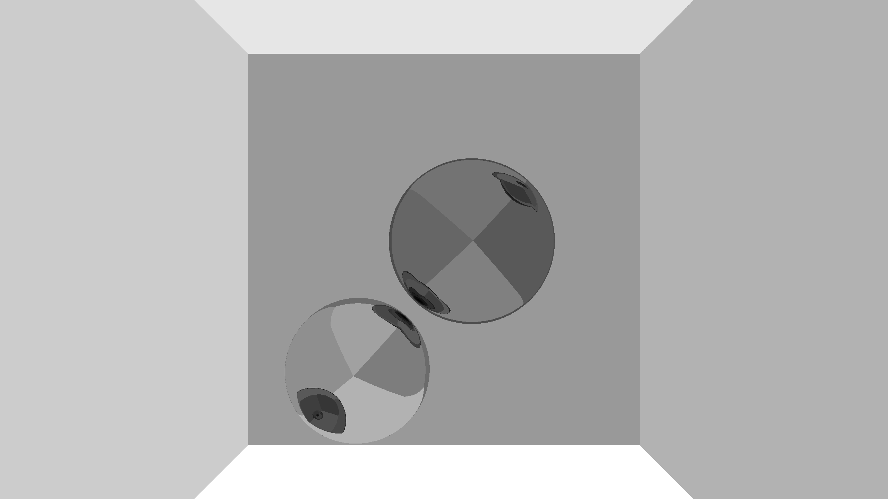
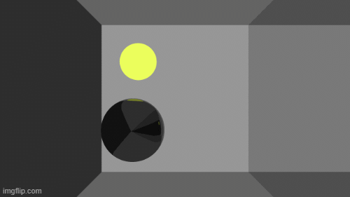

# RayJL

Simple ray tracer written in julia from scratch. Currently supports the following objects:

- sphere
- 2D plane

(Made by someone who has very little understanding in optics so a lot of the stuff about colors or light is from a rough internet search.)

TODO:

- limit max recursion depth
- matte textures
  - add a bit of randomness to incident ray
- anti aliasing
- dielectrics
  - refraction and snell's law
