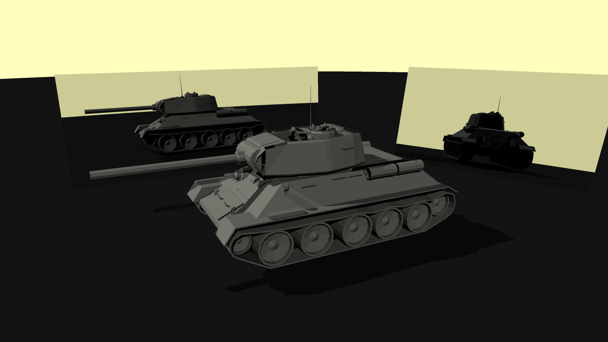
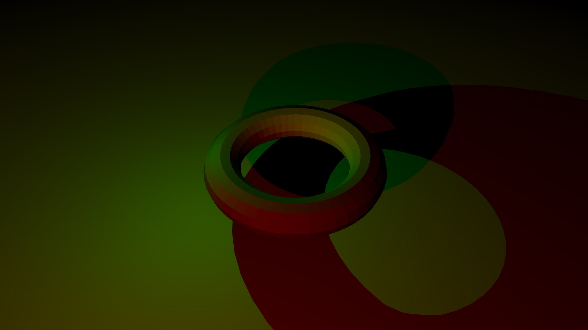

# RayJL

Ray tracing library written in Julia (and a bit of Python) with minimal dependencies.

## Features

- Triangle and polygon meshes
- Colored directional and point lights
- Lamberterian reflection, Fresnel refraction and shadows
- Look from/at camera model
- Progress bars
- Multi-threading

## Examples

All examples can be found [here](examples/)

Example script to render torus:

```julia
using RayJL

function main()
    settings = Settings(
        from_rgb(255, 254, 188),
        Resolution(1920, 1080),
        1.0,
        70.0,
        1e-4
    )

    objects = Object[
        Sphere(Vec3(0, -100, 0), 98, Diffuse(from_rgb(255, 255, 255))),
    ]
    load_obj!("examples/torus/torus.obj", from_rgb(255, 255, 240), objects)

    lights = Light[
        PointLight(Vec3(0, 0, 0), from_rgb(0, 255, 0), 1),
        PointLight(Vec3(3, 1, 3), from_rgb(255, 0, 0), 1),
    ]

    look_from = Vec3(4, 3, 2)
    look_at = Vec3(2, 0.5, 0)

    println("Rendering $(size(objects)[1]) objects...")
    start = time()
    image = render(look_from, look_at, objects, lights, settings, 2, 5)
    println("Done in $(time() - start) seconds.")

    save_png(image, "examples/torus/image.png")
    println("Saved image to examples/torus/image.png")
end

main()
```

### Toilet

OBJ file with ~47k objects rendered in 16 minutes on 1 thread.


### Tank

OBJ file with ~5k objects rendered in 2 minutes on 8 threads.



### Torus

Torus polygon mesh with two different colored point lights.


